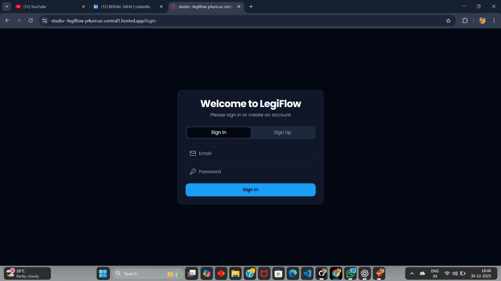

<!-- ==========================
     LEGIFLOW - README
     ========================== -->

  <h1>⚖️ Legiflow</h1>   
  
<b>Demystifying Legal Documents. Simplifying Law for Everyone.</b>
 

            
       
               

      

<h2>📌 About Legiflow</h2>

<b>Legiflow</b> is a web-based platform designed to <b>simplify and demystify complex legal documents</b> into easy-to-understand language. 
The goal of this project is to make legal knowledge more <b>accessible, practical, and user-friendly</b>, especially for students, startups, and individuals with no legal background.

<h2>✨ Key Features</h2>
<ul>
  <li>📄 <b>Legal Document Simplification</b> – Converts complex legal terms into plain and understandable language.</li>
  <li>📝 <b>Sample Agreements</b> – Ready-to-use agreement templates that users can customize as per their needs.</li>
  <li>⚖️ <b>Indian Penal Code (IPC)</b> – Complete IPC sections along with amendments.</li>
  <li>📜 <b>Indian Constitution</b> – Articles of the Indian Constitution presented in a structured and readable format.</li>
  <li>🎯 <b>User-Centric Design</b> – Clean UI focused on clarity and ease of navigation.</li>
  <li>⚠️ <b>High-Risk Agreement Identification</b> – Highlights and categorizes agreements based on risk level, helping users understand which agreements require extra caution.</li>

</ul>

<h2>🛠️ Tech Stack</h2>
<ul>
  <li><b>Primary Language:</b> TypeScript</li>
  <li><b>AObjective</h2>

Legal documents are often difficult to understand due to complex terminology and structure. 
<b>Legiflow aims to bridge the gap between law and common users</b> by presenting legal information in a simplified and practical manner, enabling users to make informed decisions without feeling overwhelmed.

<h2>🚀 Use Cases</h2>
<ul>
  <li>👨‍🎓 Law & non-law students learning Indian legal basics</li>
  <li>🚀 Startups & freelancers creating basic agreements</li>
  <li>👥 General users seeking awareness of IPC sections and constitutional rights</li>
</ul>

<h2>📷 Preview</h2>

  
    

  
    

  
    

  

<h2>🤝 Contribution</h2>

Contributions are welcome! If you have ideas to improve Legiflow or want to add new features, feel free to fork the repository and submit a pull request.

<h2>📬 Contact</h2>

<b>Developer:</b> Bishal Saha  
<b>Linkedin:</b> <a href="https://www.linkedin.com/in/bishal-saha-934484378/">Bishal Saha</a>

> ⚠️ This project is protected under a custom restricted license.  
> Unauthorized use, copying, or deployment is strictly prohibited.

  <b>⚖️ Making Law Simple, Accessible & Understandable with Legiflow ⚖️</b>

