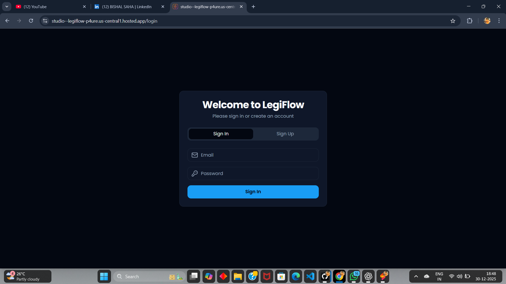

<!-- ==========================
     LEGIFLOW - README
     ========================== -->

  <h1>⚖️ Legiflow</h1>   
  
<b>Demystifying Legal Documents. Simplifying Law for Everyone.</b>

            
       
                   

<h2>📌 About Legiflow</h2>

<b>Legiflow</b> is a web-based platform designed to <b>simplify and demystify complex legal documents</b> into easy-to-understand language. 
The goal of this project is to make legal knowledge more <b>accessible, practical, and user-friendly</b>, especially for students, startups, and individuals with no legal background.

<h2>✨ Key Features</h2>
<ul>
  <li>📄 <b>Legal Document Simplification</b> – Converts complex legal terms into plain and understandable language.</li>
  <li>📝 <b>Sample Agreements</b> – Ready-to-use agreement templates that users can customize as per their needs.</li>
  <li>⚖️ <b>Indian Penal Code (IPC)</b> – Complete IPC sections along with amendments.</li>
  <li>📜 <b>Indian Constitution</b> – Articles of the Indian Constitution presented in a structured and readable format.</li>
  <li>🎯 <b>User-Centric Design</b> – Clean UI focused on clarity and ease of navigation.</li>
  <li>⚠️ <b>High-Risk Agreement Identification</b> – Highlights and categorizes agreements based on risk level, helping users understand which agreements require extra caution.</li>

</ul>

<h2>🛠️ Tech Stack</h2>
<ul>
  <li><b>Frontend:</b> React 18 + TypeScript + Next.js 15</li>
  <li><b>Styling:</b> Tailwind CSS + Radix UI</li>
  <li><b>Backend/Database:</b> Firebase (Firestore, Auth, Storage)</li>
  <li><b>AI:</b> Google Genkit + Google Gemini API</li>
  <li><b>Build Tool:</b> Turbopack</li>
  <li><b>Forms:</b> React Hook Form + Zod</li>
</ul>

<h2>🎯 Objective</h2>

Legiflow aims to bridge the gap between legal complexity and everyday users by presenting legal information in a simplified and practical manner, enabling informed decision-making.

<h2>🚀 Use Cases</h2>
<ul>
  <li>Law & non-law students learning legal basics</li>
  <li>Startups & freelancers creating agreements</li>
  <li>General users exploring IPC and constitutional rights</li>
</ul>

<h2>📷 Preview</h2>

  
    

  
    

  
    

  

<h2>📋 Prerequisites</h2>
<ul>
  <li><b>Node.js</b> (v16 or higher)</li>
  <li><b>npm</b> or <b>yarn</b></li>
  <li>A <b>Firebase project</b> with credentials</li>
  <li>A <b>Google Cloud account</b> (for Gemini API)</li>
</ul>

<h2>🔧 Setup & Installation</h2>

<h3>1. Fork the Repository</h3>
<ol>
  <li>Go to the repository</li>
  <li>Click the <b>Fork</b> button</li>
  <li>Select your GitHub account</li>
</ol>

<h3>2. Clone the Repository</h3>
<pre><code class="language-bash">git clone https://github.com/YOUR_USERNAME/Legiflow.git
cd Legiflow
</code></pre>

Replace <code>YOUR_USERNAME</code> with your GitHub username.

<h3>3. Install Dependencies</h3>
<pre><code class="language-bash">npm install
</code></pre>

<h3>4. Configure Environment Variables</h3>

Create a <code>.env.local</code> file in the root directory:

<pre><code class="language-bash">touch .env.local
</code></pre>

Add the following configuration:

<pre><code class="language-env"># Firebase
VITE_FIREBASE_API_KEY=your_api_key
VITE_FIREBASE_AUTH_DOMAIN=your_project.firebaseapp.com
VITE_FIREBASE_PROJECT_ID=your_project_id
VITE_FIREBASE_STORAGE_BUCKET=your_bucket
VITE_FIREBASE_MESSAGING_SENDER_ID=your_sender_id
VITE_FIREBASE_APP_ID=your_app_id

# Google Gemini
GOOGLE_GENKIT_API_KEY=your_api_key
</code></pre>

<h3>5. Run the Development Server</h3>
<pre><code class="language-bash">npm run dev
</code></pre>

The application will be available at <b>http://localhost:3000</b>

<h2>📁 Project Structure</h2>
<pre><code>
Legiflow/
├── src/
│   ├── app/
│   ├── components/
│   ├── hooks/
│   ├── lib/
│   ├── ai/
│   └── styles/
├── public/
├── .env.local
├── next.config.js
├── tailwind.config.js
└── package.json
</code></pre>

<h2>🤝 Contributing</h2>

Contributions are welcome! If you have ideas to improve Legiflow or want to add new features, feel free to fork the repository and submit a pull request.

<ol>
  <li>Fork the repository</li>
  <li>Create a branch:
    <pre><code class="language-bash">git checkout -b feature/your-feature</code></pre>
  </li>
  <li>Commit changes:
    <pre><code class="language-bash">git commit -m "feat: add feature"</code></pre>
  </li>
  <li>Push to your branch:
    <pre><code class="language-bash">git push origin feature/your-feature</code></pre>
  </li>
  <li>Open a Pull Request</li>
</ol>

<h2>📬 Contact</h2>

<b>Developer:</b> Bishal Saha  
<b>Linkedin:</b> <a href="https://www.linkedin.com/in/bishal-saha-934484378/">Bishal Saha</a>

> ⚠️ This project is protected under a custom restricted license.  
> Unauthorized use, copying, or deployment is strictly prohibited.

  <b>⚖️ Making Law Simple, Accessible & Understandable with Legiflow ⚖️</b>

